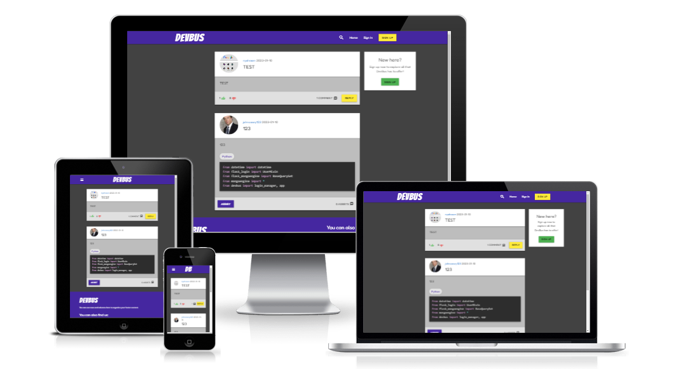
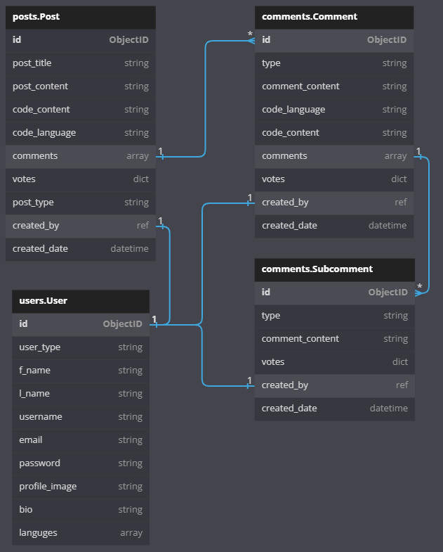
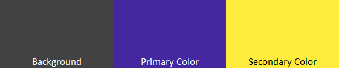
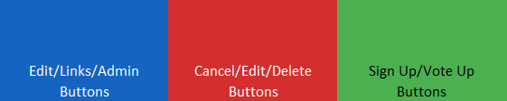
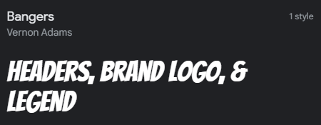
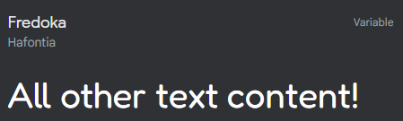

# DevBus
## Code Institute Milestone Project 3 - Backend Development
A social media website for developers that allows people to create simple text posts as well as share code, or ask for help!

 

# Table of Contents
- [UX](#ux)
  * [Strategy](#strategy)
  * [Structure](#structure)
    + Front-End Structure
    + Back-End Structure
  * [Scope](#scope)
    + [User Stories - Owner](#user-stories-website-owner)
    + [User Stories - New/Existing Users](#user-stories-new/existing-customer)
  * [Skeleton](#skeleton)
  * [Surface](#surface)
- [Features](#features)
  * [Features Left to Implement](#postrelease-features)
- [Technologies](#technologies)
- [Testing](#testing)
- [APIs](#apis)
- [Deployment](#deployment)
- [Credits](#credits)
- [Content](#content)
- [Media](#media)
- [Acknowledgements](#acknowledgements)

# User Experience

## Strategy
### Primary Goal
#### Owner side:
- To offer a social media network specifically designed for developers.
- To allow users to create normal (social) posts or ask for help using an assist post, both of which provide an option to include code content.
- To allow users to view normal (social) posts or assist others on an assist post.
- To allow users to edit their own normal (social) or assist posts.
- To allow users to delete their own normal (social) or assist posts.
- To allow users to comment on a post and include code.
- To allow users to comment on a comment.
- To allow users to vote up or down on content.
- To allow users to view other users.
- To provide a search engine which helps people find relevant content.
- To view simple site statistics on a dedicated page.

#### User side:
- To be able to create an account.
- To be able to customize my account.
- To be able to create posts.
- To be able to edit posts.
- To be able to view posts.
- To be able to delete posts.
- To be able to vote on posts.
- To be able to comment on posts.
- To be able to comment on other people's comments.
- To be able to view list of comments.

## Structure

### Front-End Structure
The website is split into 17 pages, stored in 22 html files. 

1. Home - home.html
- Landing page, and first page user encounters when they visit the website.
2. Sign In - signin.html
- The user is able to sign in to the website using an existing account, otherwise they are invited to create a new one.
3. Sign Up - signup.html
- Provides a form which users can populate to sign up for an account to use on the site.
4. Forgot Password - forgot_password.html
- In the event a user forgets their password, they can enter their e-mail address to which a token link is sent.
5. Reset Password - reset_password.html
- Presented when a user opens their reset password token link, allows them to choose a new password.
6. Change Password - change_password.html
- Available to a logged in user, allows them to change their password given they provide the old password.
7. Profile - profile.html
- Available only to the user logged in via which they can view their account info, provides links via which user can change their password, and update or delete their account.
    * If account is being deleted, it goes through "/profile/_id/delete_user" route which does not render a page.
8. Edit Profile - edit_profile.html 
- Available only to the user logged in, allows user to change edit their account details.
9.  View User - view_user.html
- Available to any logged in user, allows to view other users' profiles and their posts.
10. Search Results - search_results.html
- Page which shows the results of the search initiated by user by using the search bar. Depending on the chosen filter shows users and posts.
11. New Post - new_post.html
- Providers a form which users can populate to create a new post. In addition to the standard text input fields, this also contains two radio buttons via which the user can select the type of post they want to create normal 'social media' type post, or an assist post; there is also a switch via which users can show or hide the code language and content fields.
12. View Post - view_post.html 
- View of a single post and it's comments. If a form variable is passed from the back-end the page also includes a form which allows the user to add a new comment. Each
- If the current user is the owner of a comment, they also see a blue 'edit' and red 'delete' links/buttons.
13. Edit Post - edit_post.html
- Utilizes similar code to the New Post page, but instead the form presented is populated with the post's current content as well as a button to delete the post, which triggers a confirmation modal.
14. View Comment - view_comment.html
- View of a single comment and it's subcomments. If a form variable is passed from the back-end the page also includes a form which allows the user to add a sub comment.
15. Edit Comment - edit_comment.html 
- View of the post to which the comment belongs, as well as a form pre-populated with the comment being edited, to allow the user to edit its text and code content.
16. Edit Subcomment - edit_subcomment.html
- Much like Edit Comment, displays the post AND comment to which the sub-comment belongs to with a pre-populated form to allow the user to edit the text content.
17. Admin Page - admin/index.html
- Contains a page generated by back-end library flask-admin which comes with pre-defined templates. It allows users with account type of superuser to create/read/update/delete any user-created content on the website. 
* Other HTML files include the base jinja template for the website and the custom side navigation, and custom error pages for error 403(Forbidden), 404(Page Not Found), and 500(Internal Server Error).

I have used Materialize primarily to assist with design and responsiveness, alongside Prism which provides styling for the code area, my own custom styling, and additional media queries to further increase compatibility.
- Materialize is the first CSS library I am using, so there was a bit of a learning curve. Although very convenient, it did cause a lot of issues when it came down to creating forms and positioning things exactly the way I wanted. I had to learn to edit SASS files as well, as I wanted to change settings the easy way, but as I am using Materialize CSS locally it does cause some performance degrade, however performance was addressed once I added compression in back-end.

For the functionality, I have used jQuery and AJAX.
- Fist time using AJAX - it definitely took me a minute to grasp what the idea is, but very happy I learned how to use it; first time I am building a whole project with jQuery as well. Can definitely say it made things significantly faster to do.

### Back-End Structure

Below video series was instrumental to my understanding of Flask and has been a great inspiration:
https://www.youtube.com/playlist?list=PL-osiE80TeTs4UjLw5MM6OjgkjFeUxCYH

- Built with Flask using Blueprints structure.
- The application structure is as follows:
  * admin - contains the flask-admin views. I created Custom view as it allows me to control who is able to visit the pages. Redirected `/admin` route to a custom Admin View, which allowed me to pass my own variables onto the page which display totals of each collection.
  * auth - contains all routes related to a user's account (CRUD) including utility functions such as 
    + sending a password reset token link email to the user's e-mail address and receiving and routing said token.
    + resizing and uploading to AWS S3 bucket profile image from file uploaded by user.
  * main - contains routes for Home (landing page), Search Results, and View User pages.
  * posts - contains all CRUD routes for posts, assists, comments and subcomments, as well as the voting system.
  * static - stores CSS styles, JavaScript, SASS, as well as project and README images.
  * templates - Jinja templates for each admin, auth, main, post, base (stores base structure of all pages), and custom side navigation.
  * utils - At present stores only the `mongoengine` database models.
  * Application is created and setup by running `app.py`.

#### Physical Database Model
Below model displays all fields stored in the database collection as well as the relationships with each collection.

#### Forms
I used `flask-wtf`, which helped with creating forms and making sure correct information is passed to the database.
Forms have been stored in separate forms.py file in each routes blueprint folder.

#### Amazon Web Services (AWS) S3 bucket
While MongoDB stores our database collections, for profile image storage I chose to use an AWS S3 bucket. As images are stored and processed separately, this improves performance out of the box. It was definitely a bit tricky to setup, but once things started clicking into place things got easier. Pictures are cropped, resized into thumbnails before being uploaded to reduce file size without reducing quality.

## Scope

### Admin/Site Owner User Stories (A)
1. As an admin/site owner, I want potential users to know from the start what the site's purpose is.
2. As an admin/site owner, I want potential users to be able to register for an account.
3. As an admin/site owner, I want existing users to be able to be able to login.
4. As an admin/site owner, I want logged in users to be able to create new standard posts.
5. As an admin/site owner, I want logged in users to be able to create new assist posts.
6. As an admin/site owner, I want logged in users to be able to view other people's posts.
7. As an admin/site owner, I want logged in users to be able to edit their posts.
8. As an admin/site owner, I want logged in users to be able to delete their own posts.
9. As an admin/site owner, I want logged in users to be able to view other people's as well as their own comments.
10. As an admin/site owner, I want logged in users to be able to add comments/reply to either type of post.
11. As an admin/site owner, I want logged in users to be able to edit their comments.
12. As an admin/site owner, I want logged in users to be able to delete their comments.
13. As an admin/site owner, I want logged in users to be able to view other people's as well as their own sub-comments.
14. As an admin/site owner, I want logged in users to be able to add sub-comments/reply to comments..
15. As an admin/site owner, I want logged in users to be able to edit their sub-comments.
16. As an admin/site owner, I want logged in users to be able to delete their sub-comments.
17. As an admin/site owner, I want logged in users to be able to vote up or down other people's social posts.
18. As an admin/site owner, I want logged in users to be able to search for other users or posts.
19. As an admin/site owner, I want logged in users to be able to view each other's accounts.
20. As an admin/site owner, I want to be able to access a separate admin page, where I can view statistics.
21. As an admin/site owner, I want to be able to access a separate admin page, where I am able to create/read/update/delete users and content.
22. As an admin/site owner, I want all users to be able to contact us via e-mail or phone.
23. As an admin/site owner, I want all users to be able to be able to be able to find our accounts on other websites.
24. As an admin/site owner, i want users to be able to change or reset their passwords.

### Potential/New User User Stories (B)
1. As a potential/new user, I want to know the site's purpose from the first page.
2. As a potential/new user, I want to be able to register for a new account.
3. As a potential/new user, I want to be able to log in to my newly created account.
4. As a potential/new user, I want to be able to find out more about the company behind the site.
5. As a potential/new user, I want to be able to be able to contact the site owners.

### Existing (Logged In) User User Stories (C)
1. As an existing user, I want to be able to view my profile.
2. As an existing user, I want to be able to view other's profiles.
3. As an existing user, I want to be able to change/reset my password.
4. As an existing user, I want to be able to vote on other user's posts, comments, and sub-comments.
5. As an existing user, I want to be able to view my posts only.
6. As an existing user, I want to be able to view other people's posts.
7. As an existing user, I want to be able to create a new standard post.
8. As an existing user, I want to be able to create a new assist post.
9. As an existing user, I want to be able to edit my posts.
10. As an existing user, I want to be able to delete my posts.
11. As an existing user, I want to be able to create new comments/reply to posts.
12. As an existing user, I want to be able to view all comments on a post.
13. As an existing user, I want to be able to edit my comments.
14. As an existing user, I want to be able to delete my comments.
15. As an existing user, I want to be able to create new subcomments/reply to comments.
16. As an existing user, I want to be able to view all subcomments on a comment.
17. As an existing user, I want to be able to edit my subcomments.
18. As an existing user, I want to be able to delete my subcomments.
19. As an existing user, I want to be able to search for posts containing a specific coding language.
20. As an existing user, I want to be able to search for other users.
21. As an existing user, I want to be able to edit my account.
22. As an existing user, I want to be able to delete my account.

## Skeleton

### Wireframes

These are the Wireframes that I created at the inception of the site. Not every page that is currently used has a wireframe as they were a result of the wireframed pages.

|Mobile Wireframes 
|-------------------
|

1. Home Page

|

2. New Post Page

|

3. View Post Page

|

4. Sign In Page

|

5. Sign Up Page

|

6. User Profile Page

|Tablet Wireframes 
|-------------------
|

1. Home Page

|

2. New Post Page

|

3. View Post Page

|

4. Sign In Page

|

5. Sign Up Page

|

6. User Profile Page

|Desktop Wireframes 
|-------------------
|

1. Home Page

|

2. New Post Page

|

3. View Post Page

|

4. Sign In Page

|

5. Sign Up Page

|

6. User Profile Page

## Surface

### Color Palette

- Primary Palette

- Secondary Palette (used for buttons/links)

### Typography

- The font used for the brand logo, headers, and legends is called "Bangers" and is imported from Google Fonts library. It uses cursive as the fallback font.

- The font used for all other text content is called "Fredoka", also imported from Google Fonts library. It uses sans-serif as the fallback font.

# Features

## MVP Features

### Feature 1 - Navigation Bar

### Feature 2 - Side Bars

### Feature 3 - Footer

### Feature 4 - Landing Page

### Feature 5 - Search Bar & Search Results Page

### Feature 6 - Sign In/Sign Up 

### Feature 7 - Posts (CRUD)

### Feature 8 - Comments (CRUD)

### Feature 9 - Sub-comments (CRUD)

### Feature 10 - Profile (View, Update, & Delete)

### Feature 11 - View User

### Feature 12 - Admin Page (Flask-Admin)

### Feature 13 - Forgot/Reset Password

## Features Wishlist

