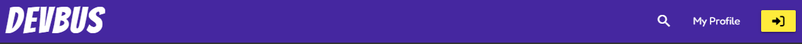
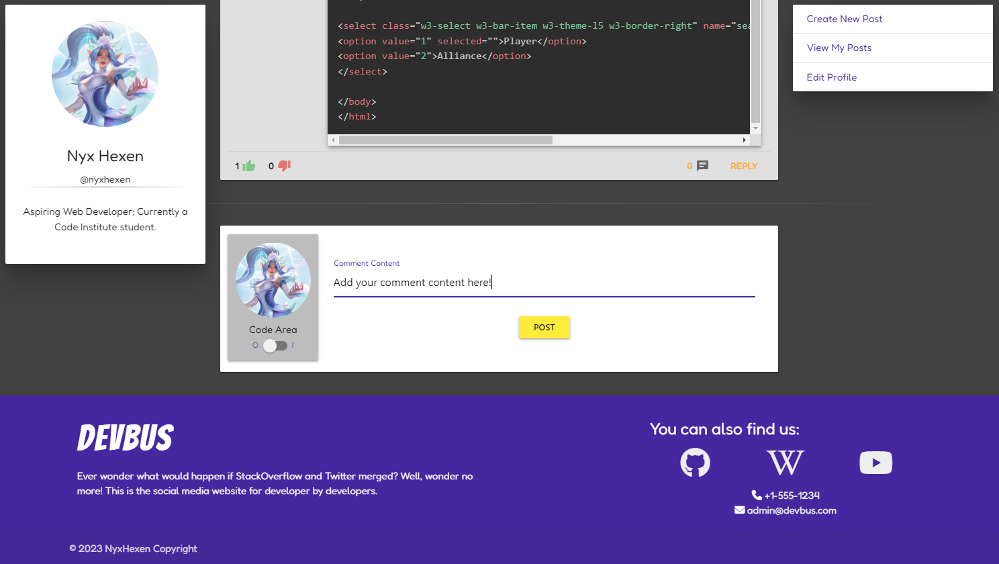
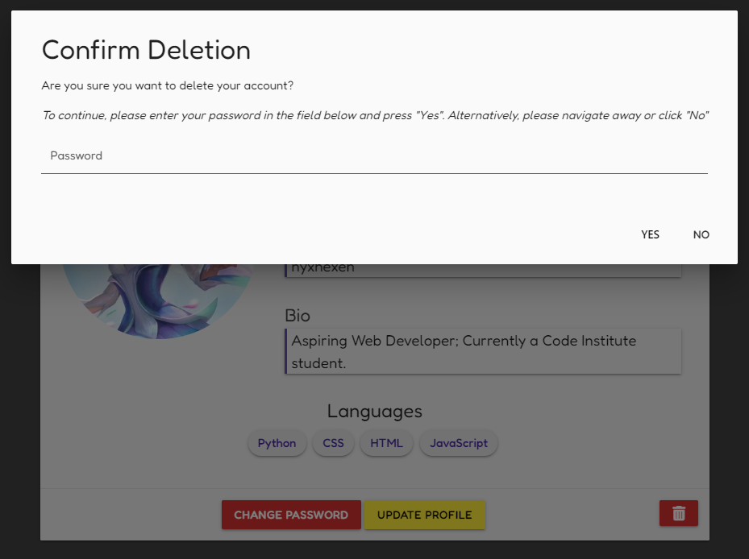
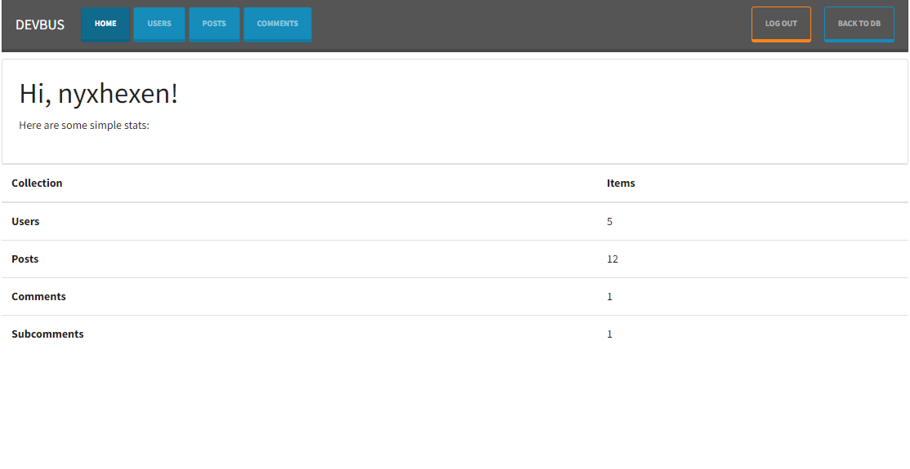
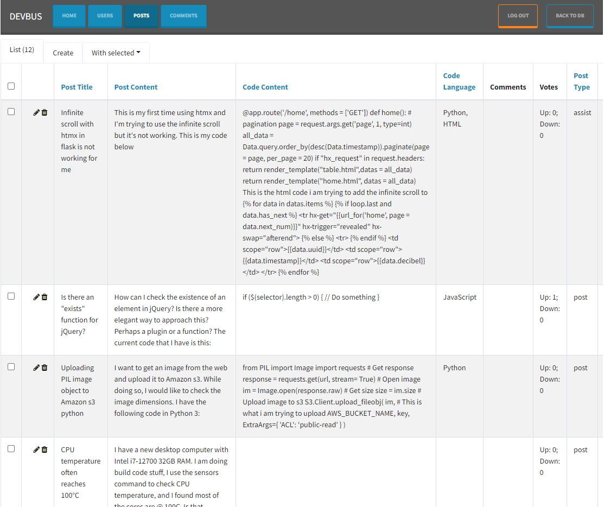
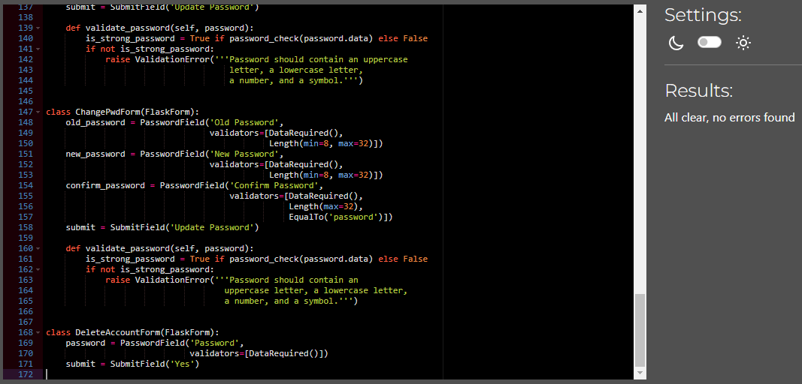
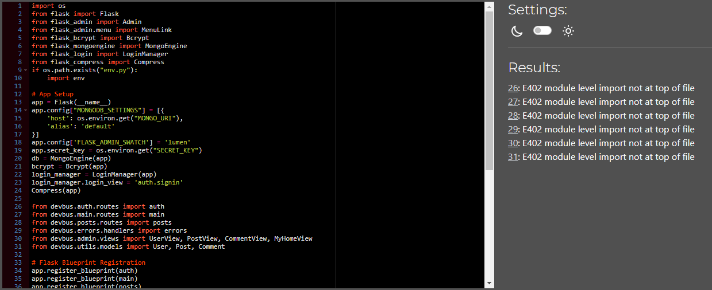
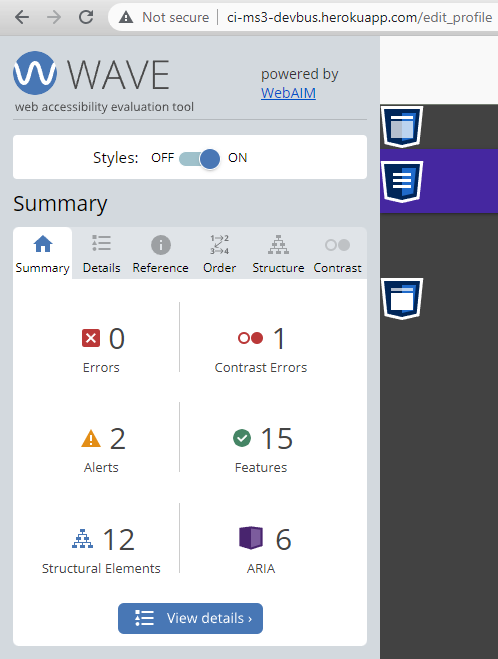
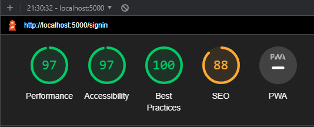
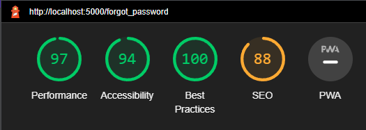

# DevBus
## Code Institute Milestone Project 3 - Backend Development
A social media website for developers that allows people to create simple text posts as well as share code, or ask for help!

 

# Table of Contents
- [UX](#ux)
  * [Strategy](#strategy)
  * [Structure](#structure)
    + Front-End Structure
    + Back-End Structure
  * [Scope](#scope)
    + [User Stories - Owner](#user-stories-website-owner)
    + [User Stories - New/Existing Users](#user-stories-new/existing-customer)
  * [Skeleton](#skeleton)
  * [Surface](#surface)
- [Features](#features)
  * [Features Left to Implement](#postrelease-features)
- [Technologies](#technologies)
- [Testing](#testing)
- [APIs](#apis)
- [Deployment](#deployment)
- [Credits](#credits)
- [Content](#content)
- [Media](#media)
- [Acknowledgements](#acknowledgements)

# User Experience

## Strategy
### Primary Goal
#### Owner side:
- To offer a social media network specifically designed for developers.
- To allow users to create normal (social) posts or ask for help using an assist post, both of which provide an option to include code content.
- To allow users to view normal (social) posts or assist others on an assist post.
- To allow users to edit their own normal (social) or assist posts.
- To allow users to delete their own normal (social) or assist posts.
- To allow users to comment on a post and include code.
- To allow users to comment on a comment.
- To allow users to vote up or down on content.
- To allow users to view other users.
- To provide a search engine which helps people find relevant content.
- To view simple site statistics on a dedicated page.

#### User side:
- To be able to create an account.
- To be able to customize my account.
- To be able to create posts.
- To be able to edit posts.
- To be able to view posts.
- To be able to delete posts.
- To be able to vote on posts.
- To be able to comment on posts.
- To be able to comment on other people's comments.
- To be able to view list of comments.

## Structure

### Front-End Structure
The website is split into 17 pages, stored in 22 html files. 

1. Home - home.html
- Landing page, and first page user encounters when they visit the website.
2. Sign In - signin.html
- The user is able to sign in to the website using an existing account, otherwise they are invited to create a new one.
3. Sign Up - signup.html
- Provides a form which users can populate to sign up for an account to use on the site.
4. Forgot Password - forgot_password.html
- In the event a user forgets their password, they can enter their e-mail address to which a token link is sent.
5. Reset Password - reset_password.html
- Presented when a user opens their reset password token link, allows them to choose a new password.
6. Change Password - change_password.html
- Available to a logged in user, allows them to change their password given they provide the old password.
7. Profile - profile.html
- Available only to the user logged in via which they can view their account info, provides links via which user can change their password, and update or delete their account.
    * If account is being deleted, it goes through "/profile/_id/delete_user" route which does not render a page.
8. Edit Profile - edit_profile.html 
- Available only to the user logged in, allows user to change edit their account details.
9.  View User - view_user.html
- Available to any logged in user, allows to view other users' profiles and their posts.
10. Search Results - search_results.html
- Page which shows the results of the search initiated by user by using the search bar. Depending on the chosen filter shows users and posts.
11. New Post - new_post.html
- Providers a form which users can populate to create a new post. In addition to the standard text input fields, this also contains two radio buttons via which the user can select the type of post they want to create normal 'social media' type post, or an assist post; there is also a switch via which users can show or hide the code language and content fields.
12. View Post - view_post.html 
- View of a single post and it's comments. If a form variable is passed from the back-end the page also includes a form which allows the user to add a new comment. Each
- If the current user is the owner of a comment, they also see a blue 'edit' and red 'delete' links/buttons.
13. Edit Post - edit_post.html
- Utilizes similar code to the New Post page, but instead the form presented is populated with the post's current content as well as a button to delete the post, which triggers a confirmation modal.
14. View Comment - view_comment.html
- View of a single comment and it's subcomments. If a form variable is passed from the back-end the page also includes a form which allows the user to add a sub comment.
15. Edit Comment - edit_comment.html 
- View of the post to which the comment belongs, as well as a form pre-populated with the comment being edited, to allow the user to edit its text and code content.
16. Edit Subcomment - edit_subcomment.html
- Much like Edit Comment, displays the post AND comment to which the sub-comment belongs to with a pre-populated form to allow the user to edit the text content.
17. Admin Page - admin/index.html
- Contains a page generated by back-end library flask-admin which comes with pre-defined templates. It allows users with account type of superuser to create/read/update/delete any user-created content on the website. 
* Other HTML files include the base jinja template for the website and the custom side navigation, and custom error pages for error 403(Forbidden), 404(Page Not Found), and 500(Internal Server Error).

I have used Materialize primarily to assist with design and responsiveness, alongside Prism which provides styling for the code area, my own custom styling, and additional media queries to further increase compatibility.
- Materialize is the first CSS library I am using, so there was a bit of a learning curve. Although very convenient, it did cause a lot of issues when it came down to creating forms and positioning things exactly the way I wanted. I had to learn to edit SASS files as well, as I wanted to change settings the easy way, but as I am using Materialize CSS locally it does cause some performance degrade, however performance was addressed once I added compression in back-end.

For the functionality, I have used jQuery and AJAX.
- Fist time using AJAX - it definitely took me a minute to grasp what the idea is, but very happy I learned how to use it; first time I am building a whole project with jQuery as well. Can definitely say it made things significantly faster to do.

#### Images

The only image on the website, used as a default profile picture has been sourced through Pexels free download link.

https://www.pexels.com/photo/silhouette-photo-of-person-during-golden-hour-2475138/

### Back-End Structure

Below video series was instrumental to my understanding of Flask and has been a great inspiration:
https://www.youtube.com/playlist?list=PL-osiE80TeTs4UjLw5MM6OjgkjFeUxCYH

- Built with Flask using Blueprints structure.
- The application structure is as follows:
  * admin - contains the flask-admin views. I created Custom view as it allows me to control who is able to visit the pages. Redirected `/admin` route to a custom Admin View, which allowed me to pass my own variables onto the page which display totals of each collection. In addition, I have created an override method which handles dictionaries containing lists of reference fields.
  * auth - contains all routes related to a user's account (CRUD) including utility functions such as 
    + sending a password reset token link email to the user's e-mail address and receiving and routing said token.
    + resizing and uploading to AWS S3 bucket profile image from file uploaded by user.
  * main - contains routes for Home (landing page), Search Results, and View User pages.
  * posts - contains all CRUD routes for posts, assists, comments and subcomments, as well as the voting system.
  * static - stores CSS styles, JavaScript, SASS, as well as project and README images.
  * templates - Jinja templates for each admin, auth, main, post, base (stores base structure of all pages), and custom side navigation.
  * utils - At present stores only the `mongoengine` database models.
  * Application is created and setup by running `app.py`.

Additional gadgets used in back-end:
- Flask-Admin - To create the Admin page.
- Flask-Bcrypt - Password Encryption.
- Flask-Compress - To improve performance of the app by compressing it, due to Materialize CSS being local.
- Flask-Login - Which is fueling all authentication functions, including sign in and sign up.
- Flask-Mail - Used to send the password reset token link via e-mail. 
- Flask-/Mongoengine - A Document-Object Mapper (think ORM, but for document databases) for working with MongoDB from Python.
- Flask-WTF/WTForms - To create schematics for each form and then easily use it in front-end.
- Pillow - File format support and image processing for profile images.
- botocore/boto3 - To allow me to upload user's profile images to an AWS S3 bucket.

#### Physical Database Model
Below model displays all fields stored in the database collection as well as the relationships with each collection.

There are 3 collections:
- Users - stores User profile data.
- Posts - stores Posts data.
- Comments - stores Comments and Subcomments data.

#### Forms
I used `flask-wtf`, which helped with creating forms and making sure correct information is passed to the database.
Forms have been stored in separate forms.py file in each routes blueprint folder.

#### Amazon Web Services (AWS) S3 bucket
While MongoDB stores our database collections, for profile image storage I chose to use an AWS S3 bucket. As images are stored and processed separately, this improves performance out of the box. It was definitely a bit tricky to setup, but once things started clicking into place things got easier. Pictures are cropped, resized into thumbnails before being uploaded to reduce file size without reducing quality.

## Scope

### Admin/Site Owner User Stories (A)
1. As an admin/site owner, I want potential users to know from the start what the site's purpose is.
2. As an admin/site owner, I want potential users to be able to register for an account.
3. As an admin/site owner, I want existing users to be able to be able to login.
4. As an admin/site owner, I want logged in users to be able to create new standard posts.
5. As an admin/site owner, I want logged in users to be able to create new assist posts.
6. As an admin/site owner, I want logged in users to be able to view other people's posts.
7. As an admin/site owner, I want logged in users to be able to edit their posts.
8. As an admin/site owner, I want logged in users to be able to delete their own posts.
9. As an admin/site owner, I want logged in users to be able to view other people's as well as their own comments.
10. As an admin/site owner, I want logged in users to be able to add comments/reply to either type of post.
11. As an admin/site owner, I want logged in users to be able to edit their comments.
12. As an admin/site owner, I want logged in users to be able to delete their comments.
13. As an admin/site owner, I want logged in users to be able to view other people's as well as their own sub-comments.
14. As an admin/site owner, I want logged in users to be able to add sub-comments/reply to comments.
15. As an admin/site owner, I want logged in users to be able to edit their sub-comments.
16. As an admin/site owner, I want logged in users to be able to delete their sub-comments.
17. As an admin/site owner, I want logged in users to be able to vote up or down other people's social posts.
18. As an admin/site owner, I want logged in users to be able to search for other users or posts.
19. As an admin/site owner, I want logged in users to be able to view each other's accounts.
20. As an admin/site owner, I want to be able to access a separate admin page, where I can view statistics.
21. As an admin/site owner, I want to be able to access a separate admin page, where I am able to create/read/update/delete users and content.
22. As an admin/site owner, I want all users to be able to contact us via e-mail or phone.
23. As an admin/site owner, I want all users to be able to be able to be able to find our accounts on other websites.
24. As an admin/site owner, I want users to be able to change or reset their passwords.

### Potential/New User User Stories (B)
1. As a potential/new user, I want to know the site's purpose from the first page.
2. As a potential/new user, I want to be able to register for a new account.
3. As a potential/new user, I want to be able to log in to my newly created account.
4. As a potential/new user, I want to be able to find out more about the company behind the site.
5. As a potential/new user, I want to be able to be able to contact the site owners.

### Existing (Logged In) User User Stories (C)
1. As an existing user, I want to be able to view my profile.
2. As an existing user, I want to be able to view other's profiles.
3. As an existing user, I want to be able to change/reset my password.
4. As an existing user, I want to be able to vote on other user's posts, comments.
5. As an existing user, I want to be able to view my posts only.
6. As an existing user, I want to be able to view other people's posts.
7. As an existing user, I want to be able to create a new standard post.
8. As an existing user, I want to be able to create a new assist post.
9. As an existing user, I want to be able to edit my posts.
10. As an existing user, I want to be able to delete my posts.
11. As an existing user, I want to be able to create new comments/reply to posts.
12. As an existing user, I want to be able to view all comments on a post.
13. As an existing user, I want to be able to edit my comments.
14. As an existing user, I want to be able to delete my comments.
15. As an existing user, I want to be able to create new subcomments/reply to comments.
16. As an existing user, I want to be able to view all subcomments on a comment.
17. As an existing user, I want to be able to edit my subcomments.
18. As an existing user, I want to be able to delete my subcomments.
19. As an existing user, I want to be able to search for posts containing a specific coding language.
20. As an existing user, I want to be able to search for other users.
21. As an existing user, I want to be able to edit my account.
22. As an existing user, I want to be able to delete my account.

## Skeleton

### Wireframes

These are the Wireframes that I created at the inception of the site. Not every page that is currently used has a wireframe as they were a result of the wireframed pages.

|Mobile Wireframes 
|-------------------
|

1. Home Page

|

2. New Post Page

|

3. View Post Page

|

4. Sign In Page

|

5. Sign Up Page

|

6. User Profile Page

|Tablet Wireframes 
|-------------------
|

1. Home Page

|

2. New Post Page

|

3. View Post Page

|

4. Sign In Page

|

5. Sign Up Page

|

6. User Profile Page

|Desktop Wireframes 
|-------------------
|

1. Home Page

|

2. New Post Page

|

3. View Post Page

|

4. Sign In Page

|

5. Sign Up Page

|

6. User Profile Page

## Surface

### Color Palette

- Primary Palette

- Secondary Palette (used for buttons/links)

### Typography

- The font used for the brand logo, headers, and legends is called "Bangers" and is imported from Google Fonts library. It uses cursive as the fallback font.

- The font used for all other text content is called "Fredoka", also imported from Google Fonts library. It uses sans-serif as the fallback font.

# Features

## MVP Features

### Feature 1 - Navigation Bar

Simple navigation bar which is displayed on all pages. It is a responsive Materialize component. Turns into a hamburger menu for tablet and mobile devices.

- Navigation Bar - Destkop

Navbar - Logged in as Superuser (Desktop)

Navbar - Logged in as User (Desktop)

Navbar - Not Logged In (Desktop)

- Navigation Bar - Tablet

Navbar - Logged in as User (Tablet)

Navbar - Not Logged In (Tablet)

- Navigation Bar - Mobile

Navbar - Logged in as User (Mobile)

Navbar - Not Logged In (Mobile)

- Hamburger Menu

Hamburger Menu - Logged in as Superuser

Hamburger Menu - Logged in as User

Hamburger Menu - Logged in as Superuser

### Feature 2 - Side Bars

There are two custom extra side bars/menus.

The first bar/menu has no buttons, only text and it shows the current logged in user's profile picture, name, username, and bio. It is only available when the user is logged in, and is otherwise hidden.

The second bar is a quick menu. It allows users to quickly access the links to create a new post, view their own posts, and edit their profile.

- Not Logged In
 * When not logged in, the quick menu changes into an invite for the site visitor to register an account.

- Logged  In 

### Feature 3 - Footer

The footer of the website is displayed on all pages. It consists of 2 sections: brand logo and a marketing quote.

### Feature 4 - Landing Page

The home/landing page is the first page the users visit when first accessing the website. Due to the structure and nature of the website, users should immediately be able to figure out what the site is about.

- Not Logged In

- Logged in as a Superuser

### Feature 5 - Sign In/Sign Up 

#### Sign Up Page

- This page allows the user to create a website by completing the form. I have used WTForms for creating the forms and Materialize to render the elements.
- All fields, with the exception of first and last name are mandatory.
- The username and e-mail have to be unique, i.e. no other accounts are registered with them on the database.
- The username must be a minimum of 6 characters.
- The password must be a minumum of 6 characters and contain at least one number, one lowercase and one uppercase character, as well as a special 
character.

#### Sign In Page

- Allows users to login to their account by populating the form (WTForms) with a valid username and password. 
- Users have the option to select that they remain logged in to the website.

### Feature 6 - Search Bar & Search Results Page

#### Search Bar

- Only available to logged in users.
- Search bar is displayed when a user click on the magnifying glass icon on the navigation bar.
- It consists of two fields: text input and a filter, and two buttons - a submit (left) button and a cross icon button which closes the search bar.
  * The filter is selected through a select field (dropdown menu). If the user does not select a filter, it will show all users and all posts matching the user's text query.
- The search field also has an auto-complete function which queries the server on button press and returns a list of users which, in their username, contain the user's entered text.

#### Search Results

- This is the page to which the user is redirected once they submit their search. It shows both users and posts.
- The users are displayed via a Materialize carousel component.

### Feature 7 - Posts (CRUD)

#### Create a New Post

Users can start a new post via clicking on the 'Create New Post' quick menu (Desktop) or via the Hamburger Menu (Tablet & Mobile).

- Presents the user with a form (WTForms) which they can complete to create a new post.
  * The form has two additional features:
    + Code Content Switch - when switched on shows the input fields for the code language and content.
    + Post Type Radio Buttons - depending on what the user selects, the post can either be a standard (post) or a help request (assist).

#### View Post

Users can click on the comments counter of a post to open the post into a single view, which also shows all comments added to the post.

- Each social post has voting options which are updated immediately visually and in the database thanks to AJAX.

#### Update Post

If the current user is the post owner, they are presented with a button which allows them to edit their post.

- The switch is featured in the edit page, however switching it off does not (yet) remove the code content, only hides the input fields.
- The user is also presented with a delete button at the top right of the post container.
- If they wish to cancel any changes, the user can go back by clicking on the red cross-icon button.

#### Delete Post

If the user was to press on the delete button, a modal pops up which they need to press 'Yes' on in order for the deletion to be completed.

### Feature 8 - Comments (CRUD)

#### Create Comment

The user can navigate to the new comment page by clicking the 'Reply' or 'Assist' button on a post. 

- Comments can also contain code.

#### View Comment

Comments can enter into single view, which displays all sub-comments added to the comment. 

- Comments can also receive up and down votes, as well as comments called sub-comments.
- The page displays the post to which the comment belongs, as well as the comment's sub-comments.

#### Edit Comment

If the current user is the comment owner, the comment has an 'Edit' button in addition.

- The switch is available to show and hide input fields, however switching it off does not (yet) remove the code content, only hides the input fields.

#### Delete Comment

If the current user is the comment owner, they can also delete their comment via the extra 'Delete' button which is made available on view comment page.

- The Delete button triggers a modal which the user has to press 'Yes' on to confirm and complete the deletion.

### Feature 9 - Sub-comments (CRUD)

Subcomments do not have a single page view, therefore does not have separate READ functionality, but instead uses View Comment feature.

#### Create Sub-comment

The sub-comment is the last level of content which can be added on the website. It is indented on the left to separate them from comments.

- The user can add a new sub-comment by clicking on the reply button on a comment.
- Sub-comments cannot receive votes.
- Sub-comments cannot contain code.

#### Edit Sub-comment

Users are presented with the same form (WTForms) when editing a sub-comment.

#### Delete Sub-comment

If the current user is the comment owner, they can also delete their sub-comment via the extra 'Delete' button which is made available on the sub-comment itself.

- The Delete button triggers a modal which the user has to press 'Yes' on to confirm and complete the deletion.

### Feature 10 - Profile (View, Update, & Delete)

#### View Profile

This is a separate page which only the logged in user can visit.

- The page shows the user's first and last name, username, bio, languages list, and profile picture.
- The user is also presented with a 'Change Password', 'Update Profile', and 'Delete Account' buttons.
- There are several account fields which are omitted from this view for security.

#### Update Profile

The user can navigate to this page by clicking on 'Update Profile' button from their view profile page, or via the quick menu button.

- User is able to change all of their account details, including upload a new profile picture which gets stored in an AWS S3 bucket.
- In the languages field, languages can be added by writing the name and separating them by a new line. The data is then transformed by a custom form type which I created to automate this process, into a raw string, e.g. "CSS\r\nPython\r\nHTML\r\nJavaScript".
- As with the sign up form, the username, password, and e-mail fields must meet minimum requirements outlined previously.

#### Delete Profile

In the event the user wishes to longer hold an account on the site, they can delete it completely, including any created posts, comments, and sub-comments.

- The user can delete their account by clicking on the trash can icon button (delete button) from their view profile page.
- In order to confirm and complete the deletion the user must enter their current password to ensure accounts are not deleted accidentally.

### Feature 11 - View User

This page is a single-page feature. It is similar to View Profile page, however it is accessible to any logged in user.

- Aside from the standard name, username, bio, languages, and profile picture the page also displays all of the selected user's posts with a code content indicator and a convenient link which opens the specific post.

### Feature 12 - Admin Page (Flask-Admin)

The Admin Page feature was almost entirely generated by the Flask-Admin extension.

- The landing page of Admin has been redirected to a customized Jinja template, so I can pass my own variables to display a simple count of Documents in the different collections of the database.
- I have created a Custom View which I used to:
  * Limit access to the admin page by users who do not have the user type of 'superuser'.
  * Override the `_get_list_value` built-in method to allow votes to be displayed without processing/formatting the user objects contained within the votes dictionary.

### Feature 13 - Forgot/Reset Password

#### Forgot Password 

Can be used by existing users who have forgotten their password to request a password reset link.

- If there is an account registered with the entered e-mail the server sends a password reset email containing a reset token link.

#### Reset Password

The page which users reach once they have activated/followed their password reset token link e-mailed to their inbox after entering going through the Forgot Password page. User is presented with a form to select a new password.

- The token is time sensitive and it is active for 30 minutes only. If the link has expired the user will be redirected to the sign in page and a flash/toast message will appear to notify them of the expired link.

# Technologies

|Technology | Specification |
|---|---|
|Operating System | Windows 10 x64|
|IDE | Visual Studio Code |
|Version Control| Git |
|Deployment | Heroku |
|Image Storage | AWS S3 Buckets |
|Database Host | MongoDB |
|Languages | HTML5, CSS3, JavaScript, & Jinja |
|Font - Headings & Legends | [Bangers](https://fonts.google.com/specimen/Bangers?query=Bangers) |
|Font - Other | [Montserrat](https://fonts.google.com/specimen/Fredoka?query=Fredoka) |
|Font - Fallback | sans-serif, cursive |
|Responsive Mockup | [Am I Responsive](https://ui.dev/amiresponsive) |

# Testing 

## HTML Validation

[W3C Markup Validation Service](https://validator.w3.org/) was used to validate the HTML of the website. 

As I have used Jinja templating, in order to validate the HTML I navigated to each page and used the "View Page Source" functionality, copied and then pasted the generated code into the validator.

You can tell which page is being validated by the website title which I have scrolled into view.

Home Page - home.html

Sign In - signin.html

Sign Up - signup.html

Forgot Password - forgot_password.html

Reset Password - reset_password.html

Change Password - change_password.html

Profile - profile.html

1 Warning due to h5 being used in Footer and no other heading elements.

Edit Profile - edit_profile.html 

View User - view_user.html

Errors due to 2 stray end div tag. 
After reviewing the code multiple times I was unable to locate the source as no other pages have this error and I did not find any stray end div tags.

Search Results - search_results.html

New Post - new_post.html

View Post - view_post.html 

Edit Post - edit_post.html

View Comment - view_comment.html

Edit Comment - edit_comment.html 

Edit Subcomment - edit_subcomment.html

Error Pages - 403, 404, 500

Included only one of the error pages as the remaining share structure and design, and are only different by text content.

## CSS Validation

[W3C CSS Validation Service](https://jigsaw.w3.org/css-validator/) was used to validate the CSS of the website.

Primary Styles - style.css

## JavaScript Validation

[JS Hint](https://jshint.com/) was used to validate the JavaScript of the website.

Main Script - main.js

I was unable to define the M (Materialize) variable as it is injected through the HTML file.

## Python Validation 

[CI Python Linter](https://pep8ci.herokuapp.com/) was used to validate Python code for PEP8 compliance.

Admin - views.py

Auth - forms.py

Auth - routes.py

I tried removing the spaces, then re-added code to linter and the same errors were there, but about missing spaces...

Auth - utils.py

Errors - handlers.py

Init File

Main - Forms

Main - Routes

Posts - Forms

Posts - Routes

Utils - Models

I was unable to carry over the link to a new line as it kept breaking, so I have left that one link line long.

## Accessibility

[WAVE WebAIM Web Accessibility (Chrome Plugin)](https://chrome.google.com/webstore/detail/wave-evaluation-tool/jbbplnpkjmmeebjpijfedlgcdilocofh) was used to check that the code meets accessibility standards.

Any contrast errors, unless otherwise specified, are in relation to the post buttons. I tried everything to get them to pass, however it only passes when it's a very very dark shade. I have darkened all text, though that didn't resolve the problem.

Home Page - home.html

Sign In - signin.html

Sign Up - signup.html

Forgot Password - forgot_password.html

Reset Password - reset_password.html

Change Password - change_password.html

Profile - profile.html

Edit Profile - edit_profile.html 

View User - view_user.html

Search Results - search_results.html

New Post - new_post.html

3 Contrast Errors due to visually hidden content.

View Post - view_post.html 

Edit Post - edit_post.html

View Comment - view_comment.html

Edit Comment - edit_comment.html 

Edit Subcomment - edit_subcomment.html

Error Pages - 403, 404, 500

Included only one of the error pages as the remaining share structure and design, and are only different by text content.

## Performance

[Google Lighthouse](https://developer.chrome.com/docs/lighthouse/overview/) was used to measure the website's speed and performance. 

Home Page - home.html

Sign In - signin.html

Sign Up - signup.html

Forgot Password - forgot_password.html

Reset Password - reset_password.html

Change Password - change_password.html

Profile - profile.html

Edit Profile - edit_profile.html 

View User - view_user.html

Search Results - search_results.html

New Post - new_post.html

View Post - view_post.html 

Edit Post - edit_post.html

View Comment - view_comment.html

Edit Comment - edit_comment.html 

Edit Subcomment - edit_subcomment.html

## Manual Testing

Manual testing can be found in [TESTING.md](/TESTING.md)