- [Automatic Testing](#automatic-testing)
- [Manual Testing](#manual-testing)
  * [Browser compatibility:](#browser-compatibility-)
  * [Devices tested on:](#devices-tested-on-)
  * [Testing User Stories](#testing-user-stories)

<small><i><a href='http://ecotrust-canada.github.io/markdown-toc/'>Table of contents generated with markdown-toc</a></i></small>

# Automatic Testing
Unfortunately, I did not have enough time to get familiarized and conduct automatic testing with PyTest.

# Manual Testing

## Browser compatibility
- Microsoft Edge: Functionality and styles as expected.
- Google Chrome: Functionality and styles as expected.
- Firefox: Functionality and styles as expected.
- Opera/Opera GX: Functionality and styles as expected.

## Devices tested on

- Tower desktop with 27" monitor;
- OnePlus 9 Pro.

## Testing User Stories

A1. As an admin/site owner, I want potential users to know from the start what the site's purpose is.

B1. As a potential/new user, I want to know the site's purpose from the first page.

| Feature | Action | Expected Result | Actual Result
|--- |--- |--- |---
| Landing Page | None | Due to the nature and structure of the website, the user can tell immediately what the goal of the site is. | As expected.

 Supporting Images 

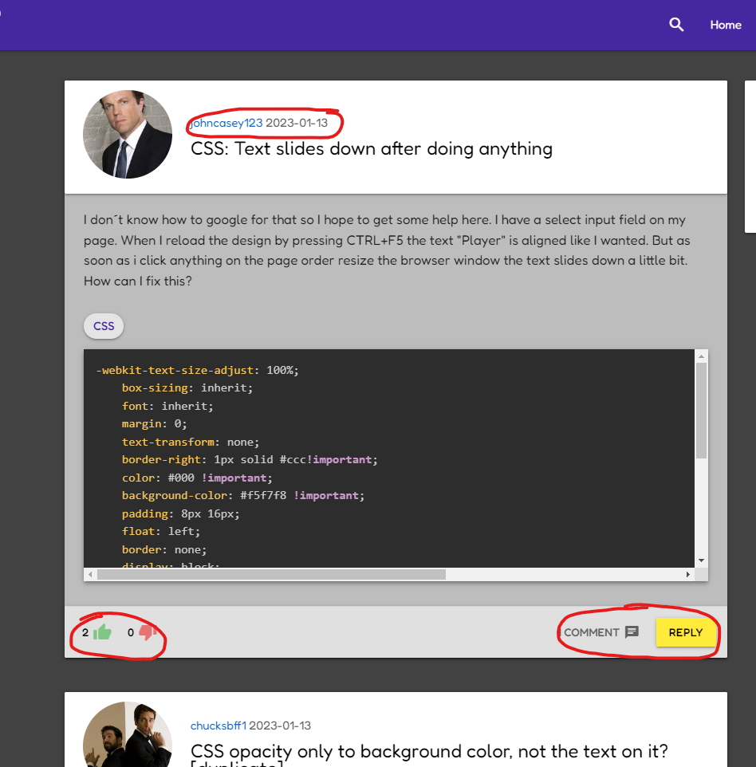

A2. As an admin/site owner, I want potential users to be able to register for an account.
B2. As a potential/new user, I want to be able to register for a new account.

| Feature | Action | Expected Result | Actual Result
|--- |--- |--- |---
| Sign Up Page | User clicks on one of the sign up buttons (navbar or quick menu) which takes them to the sign up page where they can create an account. | User is able to navigate to sign up page by clicking on either Sign Up button. | As expected.
| Sign In Page | User clicks on Sign Up button below sign in form. | User is redirected to Sign Up page where they can use the form to register. | As expected.

 Supporting Images 

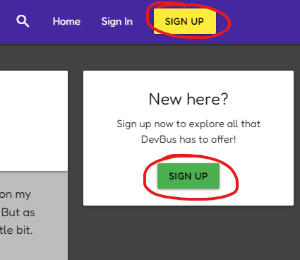
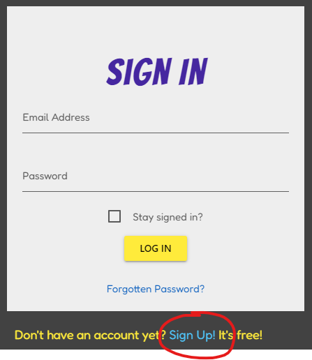
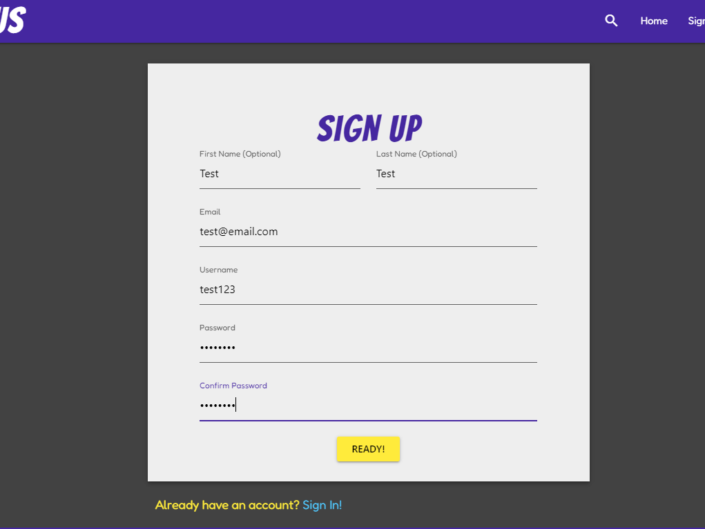
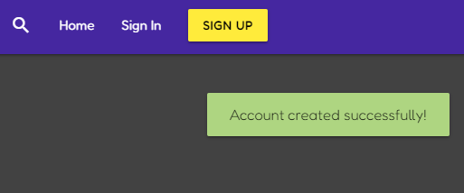

A3. As an admin/site owner, I want existing users to be able to be able to login.

B3. As a potential/new user, I want to be able to log in to my newly created account.

| Feature | Action | Expected Result | Actual Result
|--- |--- |--- |---
| Sign In Page | User clicks on Sign In nav bar button | User is redirected to Sign In page where they can use the form to login. | As expected.
| Sign Up Page | User clicks on Sign In button below sign in form. | User is redirected to Sign In page where they can use the form to login. | As expected.

 Supporting Images 

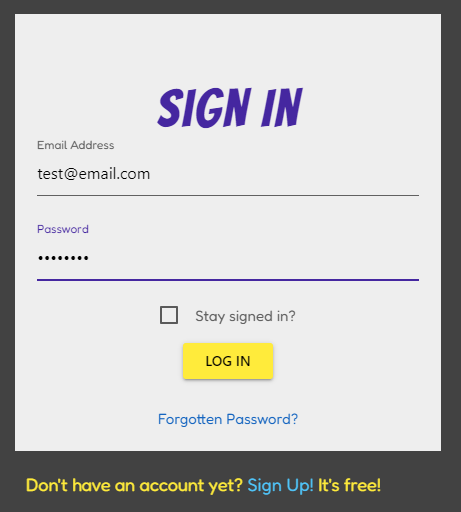
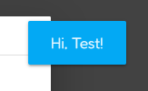
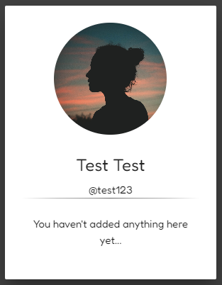

A4. As an admin/site owner, I want logged in users to be able to create new standard posts.

C7. As an existing user, I want to be able to create a new standard post.

| Feature | Action | Expected Result | Actual Result
|--- |--- |--- |---
| Any Page with Quickmenu | User clicks 'Create New Post' button from quick menu. | User is redirected to a new post page where a form can be completed to create a post. | As expected.
| Any Page on Mobile | User clicks 'Create New Post' button from hamburger menu. | User is redirected to a new post page where a form can be completed to create a post. | As expected.

 Supporting Images 

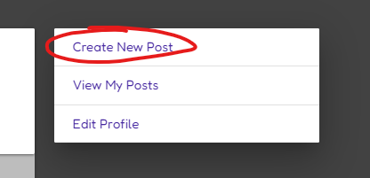
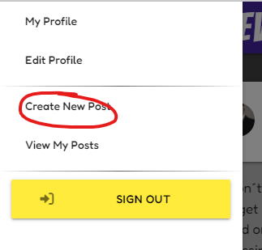
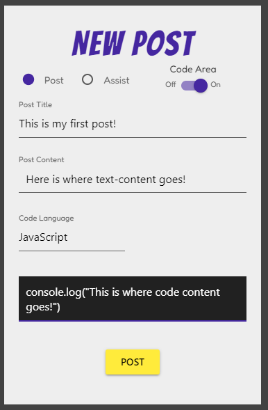
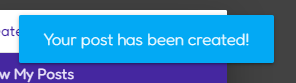
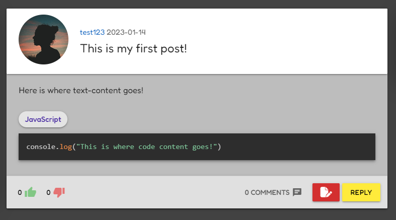

A5. As an admin/site owner, I want logged in users to be able to create new assist posts.

C8. As an existing user, I want to be able to create a new assist post.

| Feature | Action | Expected Result | Actual Result
|--- |--- |--- |---
| Any Page with Quickmenu | User clicks 'Create New Post' button from quick menu. | User is redirected to a new post page containing a form, on which user can select 'Assist' radio button and complete the form to create a assist post. | As expected.
| Any Page on Mobile | User clicks 'Create New Post' button from hamburger menu. | User is redirected to a new post page containing a form, on which user can select 'Assist' radio button and complete the form to create a assist post. | As expected.

 Supporting Images 

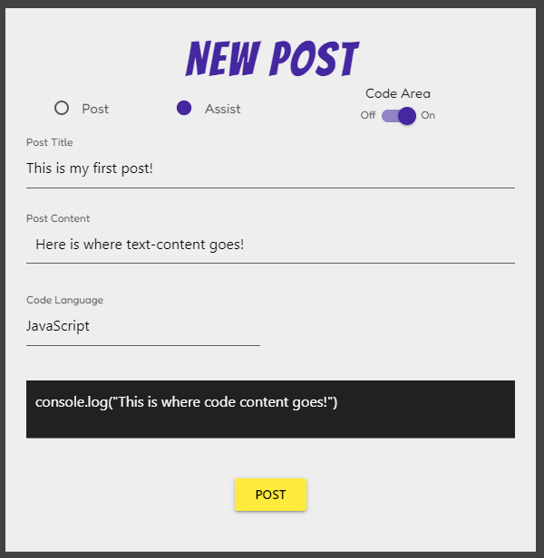
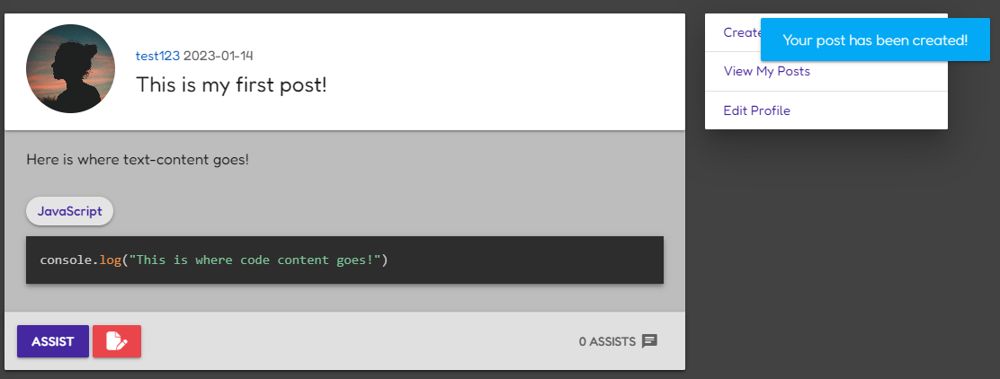

A6. As an admin/site owner, I want logged in users to be able to view other people's posts.

C6. As an existing user, I want to be able to view other people's posts.

| Feature | Action | Expected Result | Actual Result
|--- |--- |--- |---
| Home Page, Search Page, View Post Page   | User can click on a post's 'comments/assists' counter or 'Reply/Assist' buttons to view the post in single-view. | Both navigation options work as intended and the user is able to view the post. | As expected.

 Supporting Images 

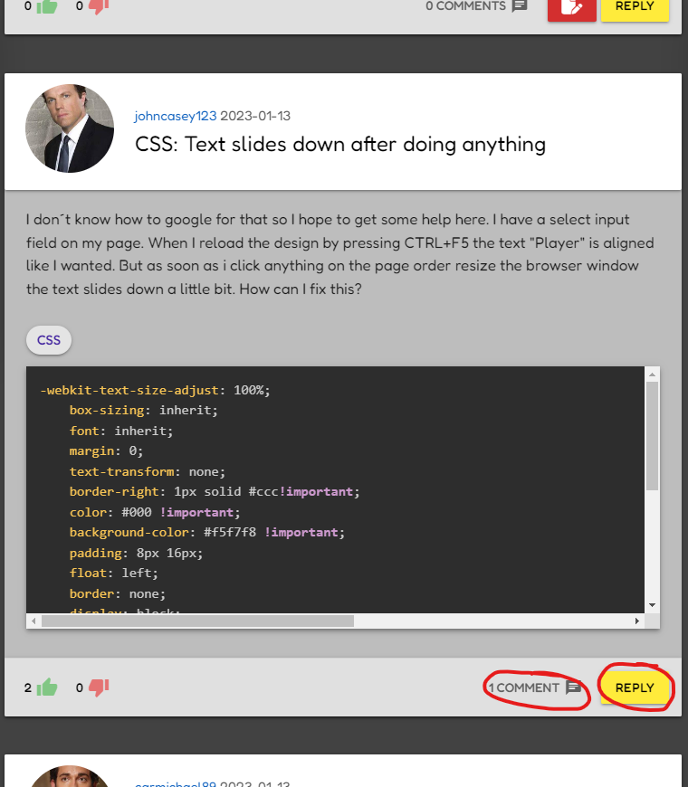
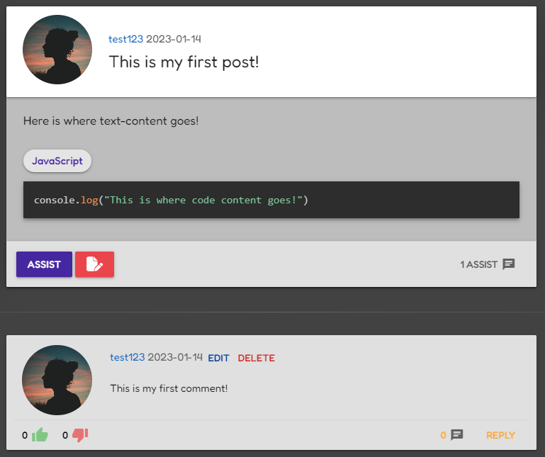

A7. As an admin/site owner, I want logged in users to be able to edit their posts.

C9. As an existing user, I want to be able to edit my posts.

| Feature | Action | Expected Result | Actual Result
|--- |--- |--- |---
| Home Page, Search Page, View Post Page  | If user is owner of post, they can click on the Edit Post button which redirects them to a pre-populated form. | Buttons work as intended and member is redirected to pre-populated form. | As expected.

 Supporting Images 

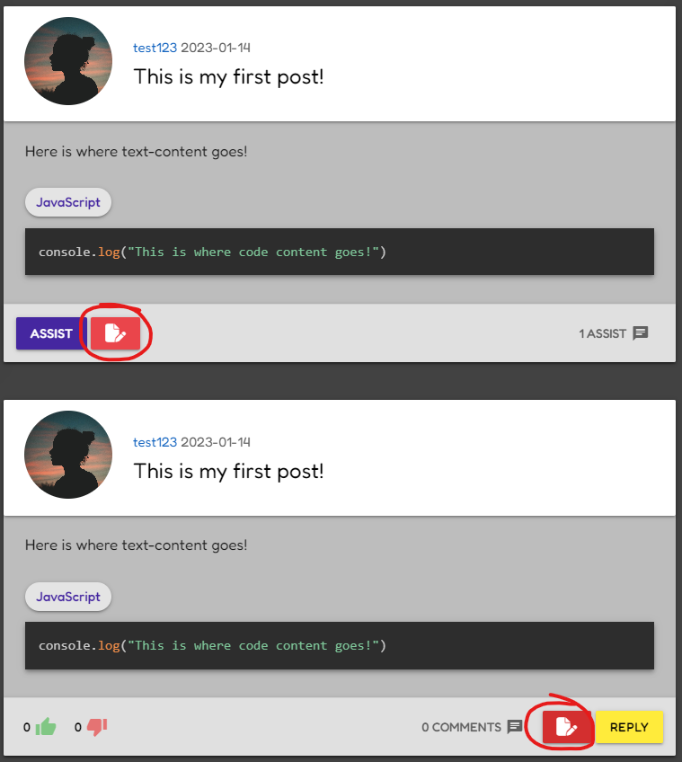
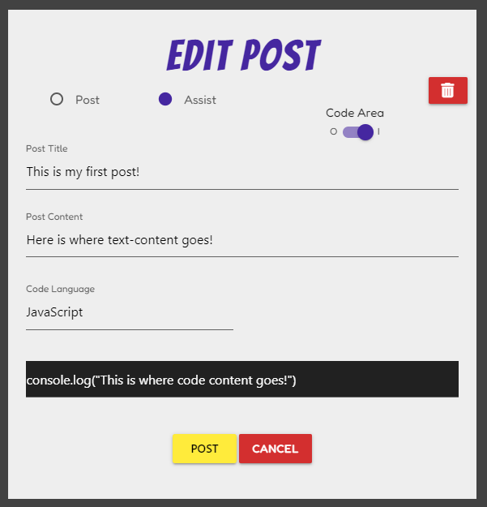
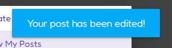

A8. As an admin/site owner, I want logged in users to be able to delete their own posts.

C10. As an existing user, I want to be able to delete my posts.

| Feature | Action | Expected Result | Actual Result
|--- |--- |--- |---
| Home Page, Search Page, View Post Page  | If user is owner of post, they can click on the Edit Post button which redirects them to a pre-populated form. When delete button is clicked, a modal should appear to ask for deletion confirmation. | Buttons work as intended and member is redirected to pre-populated form, where they can click on a button to bring up the deletion confirmation modal. On confirmation the post is deleted. | As expected.

 Supporting Images 

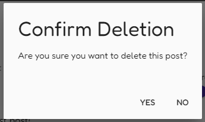
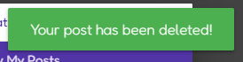

A9. As an admin/site owner, I want logged in users to be able to view other people's as well as their own comments.

C12. As an existing user, I want to be able to view all comments on a post.

| Feature | Action | Expected Result | Actual Result
|--- |--- |--- |---
| Home Page, Search Page, View Post Page   | User can click on a post's 'comments/assists' counter or 'Reply/Assist' buttons to view the post in single-view, below which comments are listed | Both navigation options work as intended and the user is able to view all comments of a post. | As expected.

 Supporting Images 

A10. As an admin/site owner, I want logged in users to be able to add comments/reply to either type of post.

C11. As an existing user, I want to be able to create new comments/reply to posts.

| Feature | Action | Expected Result | Actual Result
|--- |--- |--- |---
| Home Page, Search Page, View Post Page  | User can click on 'Reply' button which redirects them to a view post page with a form at the bottom which the user can complete to add a comment. | User clicks on 'Reply' button and is redirected to a form they can populate to create a comment. | As expected.

 Supporting Images 

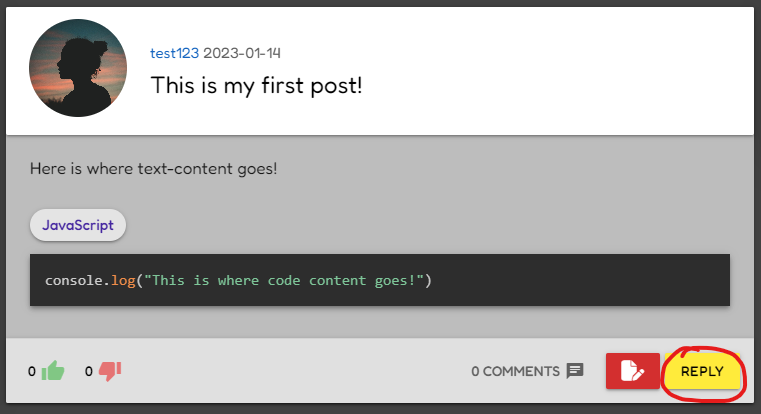
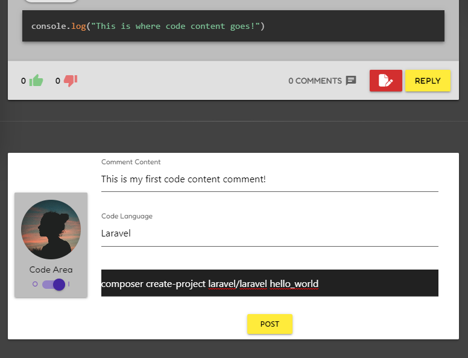
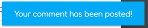

A11. As an admin/site owner, I want logged in users to be able to edit their comments.

C13. As an existing user, I want to be able to edit my comments.

| Feature | Action | Expected Result | Actual Result
|--- |--- |--- |---
| View Post Page  | If logged in user is owner of a comment, they can click on the blue 'Edit' link on the comment, which will redirect them to a page similar to the add comment feature, but with a pre-populated form they can edit. | User can click on 'Edit' link and is redirected to a page with a pre-populated form. | As expected.

 Supporting Images 

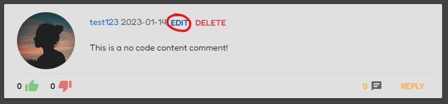
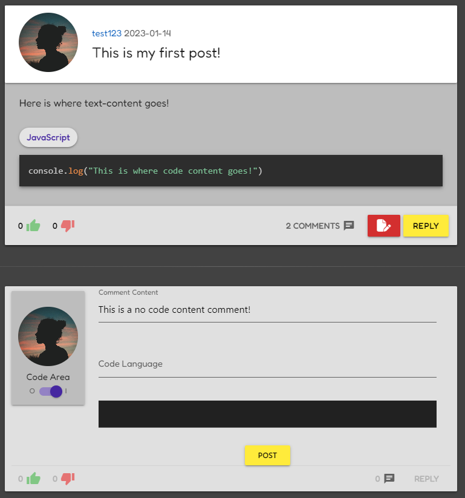
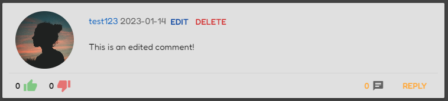
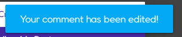

A12. As an admin/site owner, I want logged in users to be able to delete their comments.

C14. As an existing user, I want to be able to delete my comments.

| Feature | Action | Expected Result | Actual Result
|--- |--- |--- |---
| View Post Page  | If logged in user is owner of a comment, they can click on the blue 'DELETE' link on the comment, open a deletion confirmation modal. | User can click on 'DELETE' link, modal is shown, and upon confirmation the content is deleted. | As expected.

 Supporting Images 

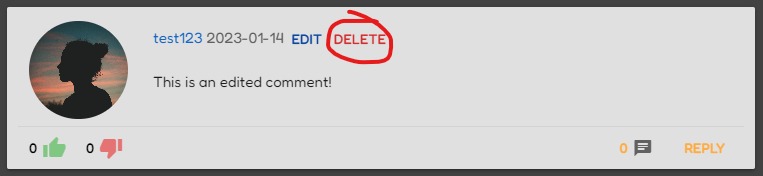
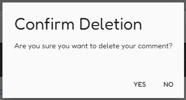
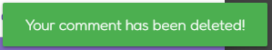

A13. As an admin/site owner, I want logged in users to be able to view other people's as well as their own sub-comments.

C16. As an existing user, I want to be able to view all subcomments on a comment.

| Feature | Action | Expected Result | Actual Result
|--- |--- |--- |---
| Home Page, Search Page, View Post Page   | User can click on a post's 'comments/assists' counter or 'Reply/Assist' buttons to view the post in single-view, below which comments are listed. Then to view subcomments, they have to click on the comment's own 'Reply' or comments/assists counter. | User successfully navigates to view comments page and is able to view all subcomments. | As expected.

 Supporting Images 

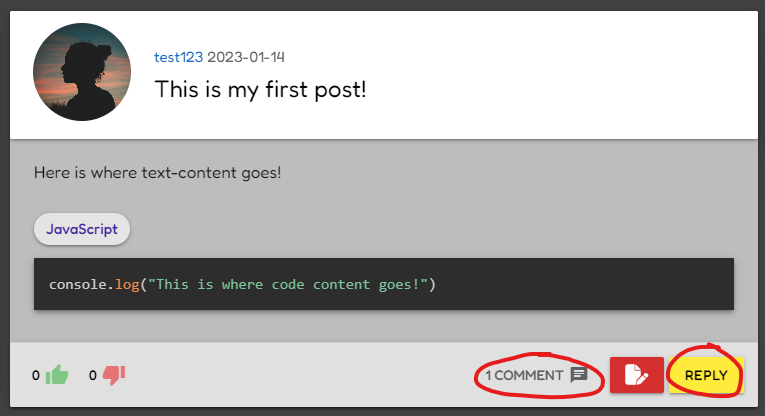
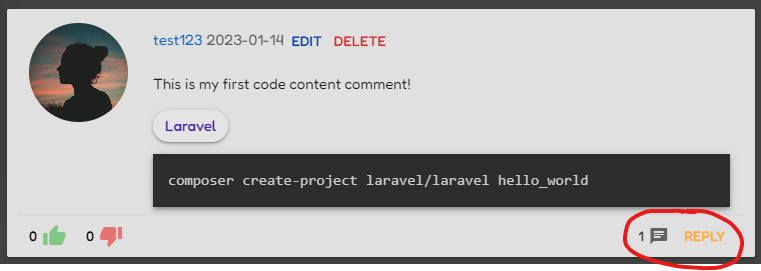
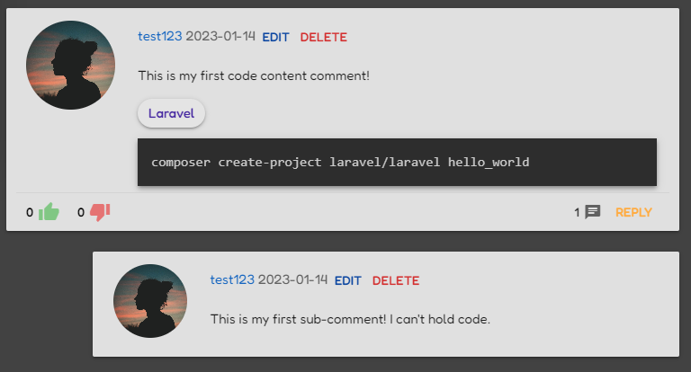

A14. As an admin/site owner, I want logged in users to be able to add sub-comments/reply to comments.

B15. As an existing user, I want to be able to create new subcomments/reply to comments.

| Feature | Action | Expected Result | Actual Result
|--- |--- |--- |---
| Home Page, Search Page, View Post Page   | User can click on'Reply' button to be redirected to a page at the bottom of which is a form they can complete to submit a new sub-comment. | User successfully navigates to view comments page and is able to submit a new subcomment via form below post's comments. | As expected.

 Supporting Images 

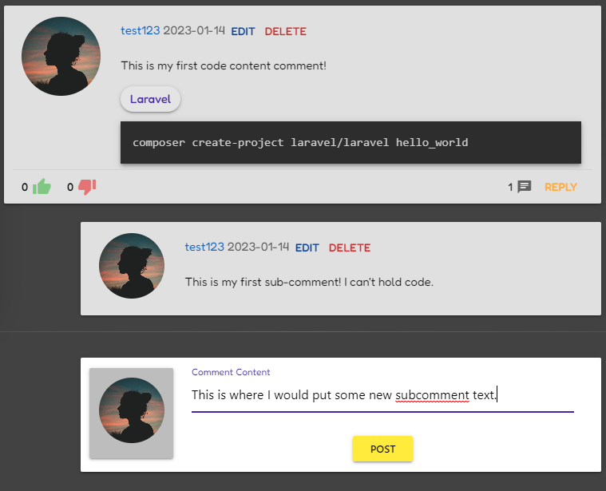

A15. As an admin/site owner, I want logged in users to be able to edit their sub-comments.

C17. As an existing user, I want to be able to edit my subcomments.

| Feature | Action | Expected Result | Actual Result
|--- |--- |--- |---
| Home Page, Search Page, View Post Page   | User can click on a post's 'comments/assists' counter or 'Reply/Assist' buttons to view the post in single-view, below which comments are listed. Then to view subcomments, they must to click on the comment's own 'Reply' button which redirects them to a similar page, but with a prepopulated form from the sub-comment at the bottom. | User successfully navigates to view comments page and is able to edit their sub-comment. | As expected.

 Supporting Images 

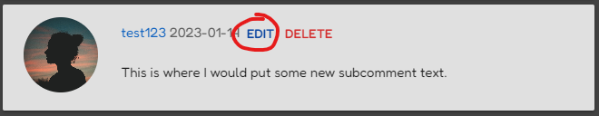

A16. As an admin/site owner, I want logged in users to be able to delete their sub-comments.

C18. As an existing user, I want to be able to delete my subcomments.

| Feature | Action | Expected Result | Actual Result
|--- |--- |--- |---
| Home Page, Search Page, View Post Page   | User can click on a post's 'comments/assists' counter or 'Reply/Assist' buttons to view the post in single-view, below which comments are listed. Then to view subcomments, they must to click on the comment's own 'Reply' or comment assist counter button which redirects them to view comment page,. From there the user clicks on the 'DELETE' link. | User successfully navigates to view comments page and is able to delete their subcomment. | As expected.

 Supporting Images 

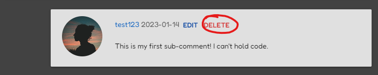

A17. As an admin/site owner, I want logged in users to be able to vote up or down other people's social posts.

C4. As an existing user, I want to be able to vote on other user's posts, comments.

| Feature | Action | Expected Result | Actual Result
|--- |--- |--- |---
| Home Page, Search Page, View Post Page   | User clicks on vote up or vote down buttons of a post or comment which immediately reflects their choice. | User's vote choice is reflected visually and in the database on button click. | As expected.

 Supporting Images 

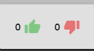
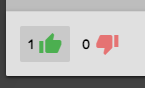
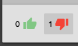

A18. As an admin/site owner, I want logged in users to be able to search for other users or posts.

C19. As an existing user, I want to be able to search for posts containing a specific coding language.

C20. As an existing user, I want to be able to search for other users.

| Feature | Action | Expected Result | Actual Result
|--- |--- |--- |---
| Any  | User can display search bar by clicking on magnifying glass icon button. User is able to search by usernames or languages. On submission, user is redirected to Search Results page where they can view the results. | User's vote choice is reflected visually and in the database on button click. | As expected.

 Supporting Images 

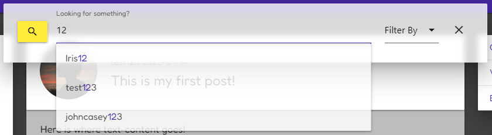
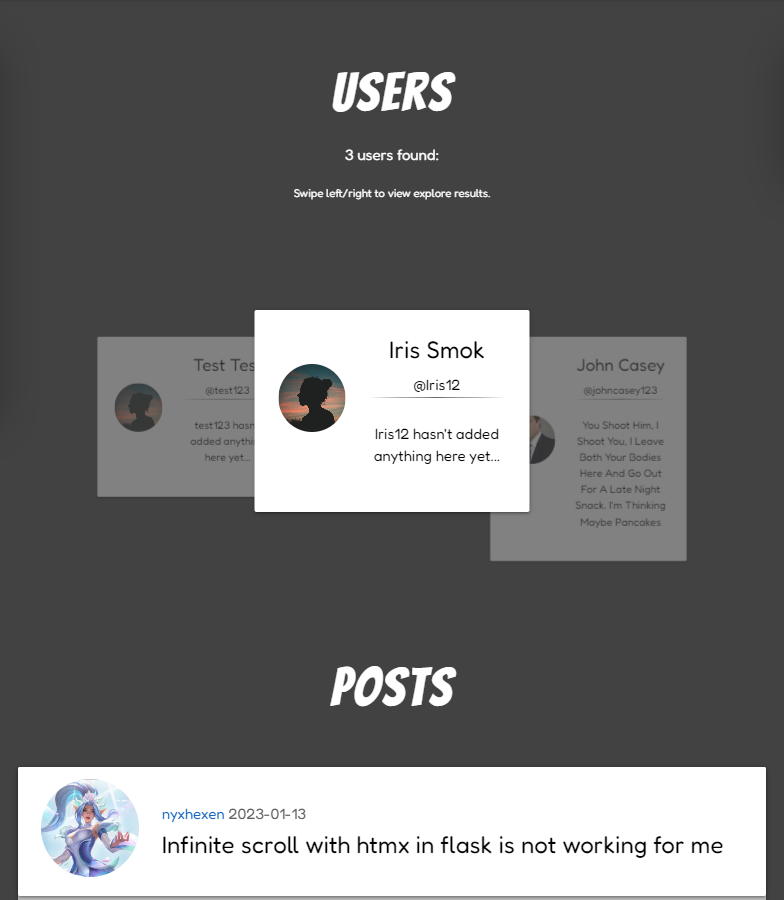

A19. As an admin/site owner, I want logged in users to be able to view each other's accounts.

C6. As an existing user, I want to be able to view other people's posts.

C20. As an existing user, I want to be able to search for other users.

| Feature | Action | Expected Result | Actual Result
|--- |--- |--- |---
| Any  | User can click on the username shown on a post, comment or subcomment to be redirected to a single-view of another user's profile. | On clicking a post/comment/subcomment author's username they are redirected to a view of the author's profile. | As expected.

 Supporting Images 

A20. As an admin/site owner, I want to be able to access a separate admin page, where I can view statistics.

A21. As an admin/site owner, I want to be able to access a separate admin page, where I am able to create/read/update/delete users and content.

| Feature | Action | Expected Result | Actual Result
|--- |--- |--- |---
| Any  | Any account with user type of 'superuser' has a button link via which they can enter the admin area. | Superuser clicks on Admin Page button and is redirected to admin area. | As expected.

 Supporting Images 

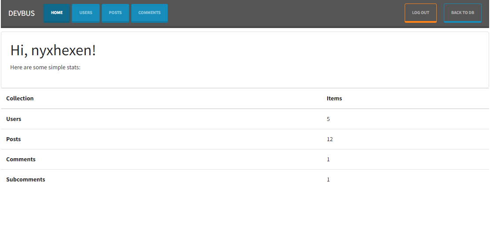
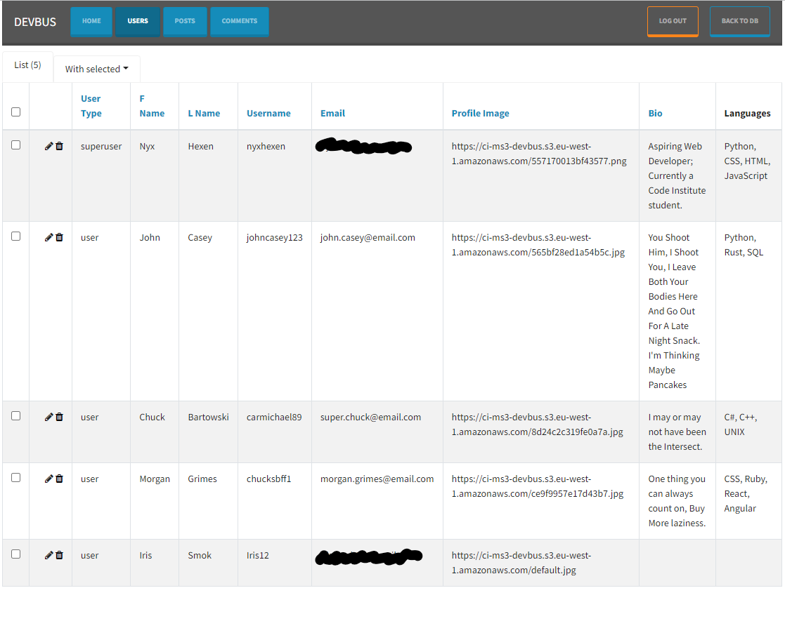
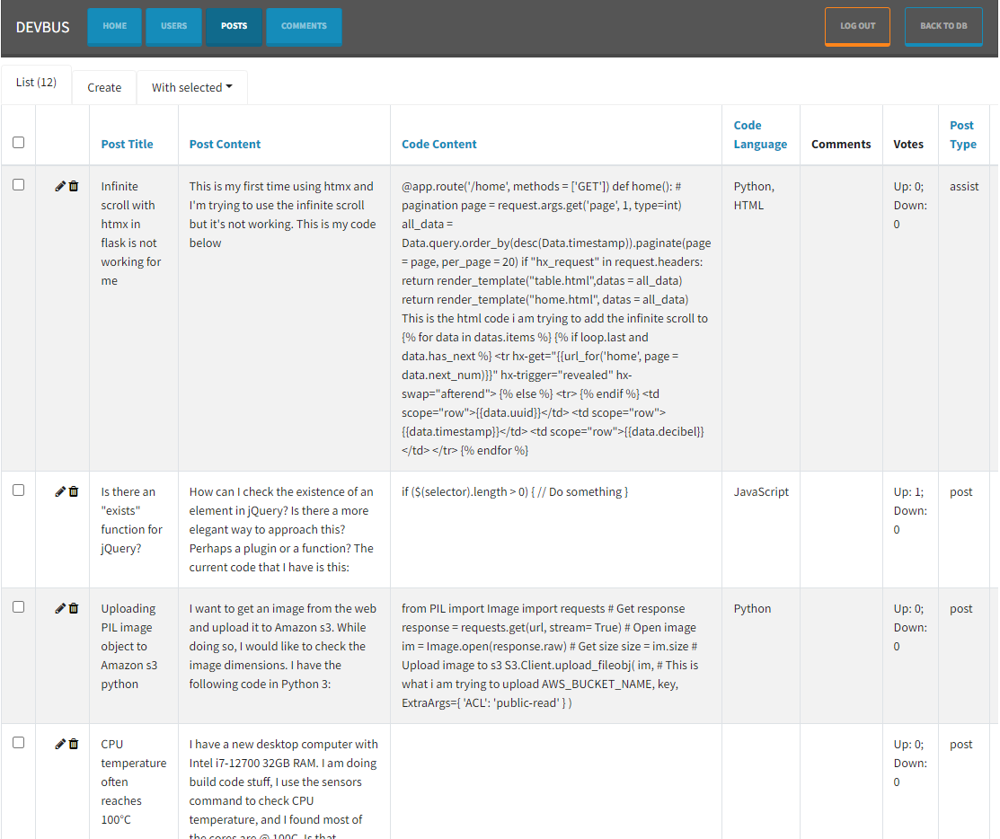
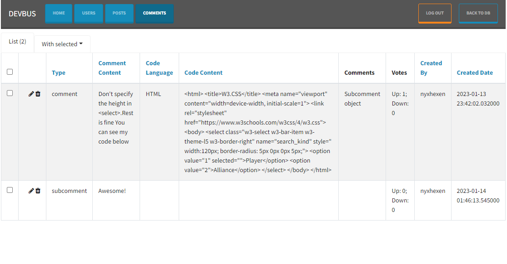

A22. As an admin/site owner, I want all users to be able to contact us via e-mail or phone.

B5. As a potential/new user, I want to be able to be able to contact the site owners.

| Feature | Action | Expected Result | Actual Result
|--- |--- |--- |---
| Footer  | User can scroll to the bottom of page to locate footer, and is able to copy or click to open the e-mail and phone links. | User successfully locates contact information within Footer. | As expected.

 Supporting Images 

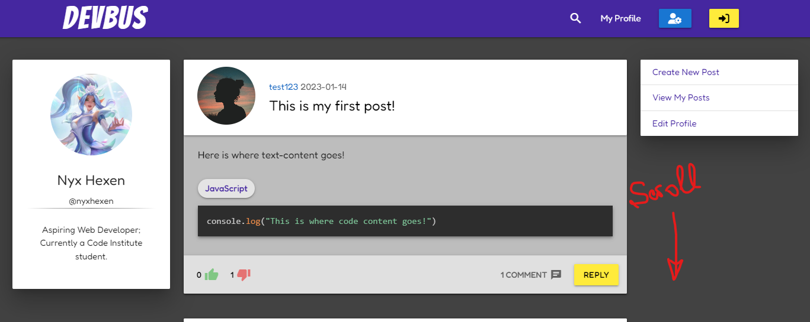
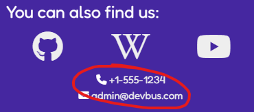

A23. As an admin/site owner, I want all users to be able to be able to be able to find our accounts on other websites.

B4. As a potential/new user, I want to be able to find out more about the company behind the site.

| Feature | Action | Expected Result | Actual Result
|--- |--- |--- |---
| Footer  | User can scroll to the bottom of page to locate footer, click on the website logos to open the link in a new tab. | User is able to open links in a new tab. | As expected.

 Supporting Images 

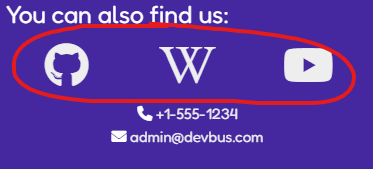

A24. As an admin/site owner, I want users to be able to change or reset their passwords.

- Forgot Password - Request Token

| Feature | Action | Expected Result | Actual Result
|--- |--- |--- |---
| Sign In Page  | User can click on link below sign in form which redirects them to a form with an e-mail field which they can complete to receive a password reset email. | User requests password reset e-mail; e-mail successfully arrives | As expected.

 Supporting Images 

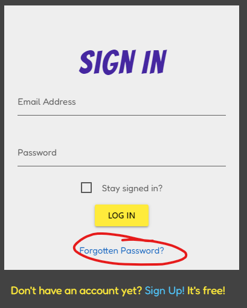
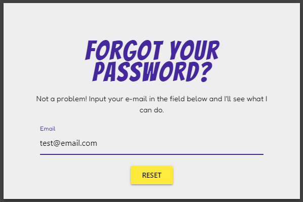
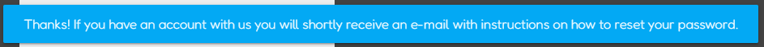
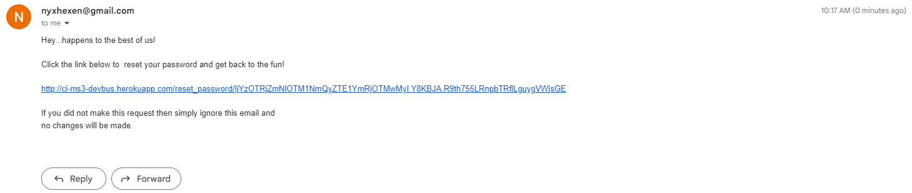

- Reset Password - Activate Token

| Feature | Action | Expected Result | Actual Result
|--- |--- |--- |---
| Reset Password Page  | Upon receipt of the password reset e-mail the user can click on the token link to be redirected to the reset password page, on which they can choose a new password by populating a form. | Token successfully activates, user is able to change their password. | As expected.

 Supporting Images 

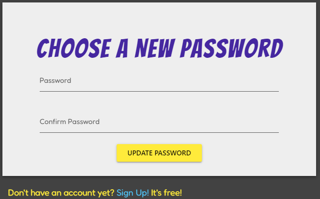
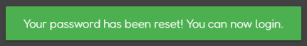

C21. As an existing user, I want to be able to edit my account.

| Feature | Action | Expected Result | Actual Result
|--- |--- |--- |---
| Profile Page  | At the bottom of a the profile page, the user can click 'Update Profile' to be redirected to a form via which they can change all details (excl password) | User is successfully redirected to Edit Profile page and is successful in adding/changing their information. | As expected.

 Supporting Images 

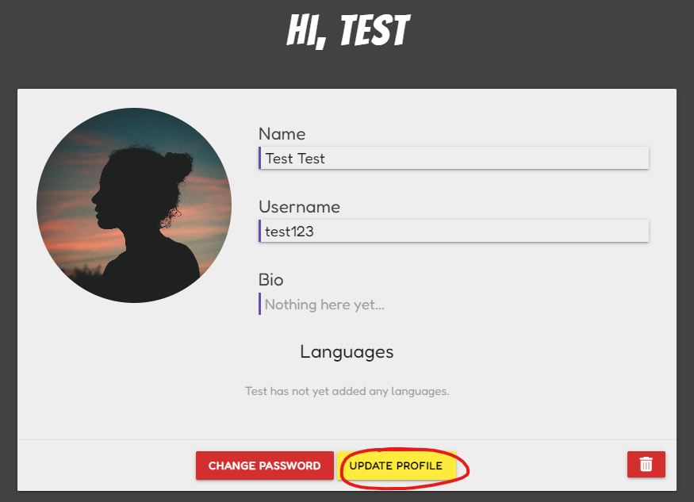
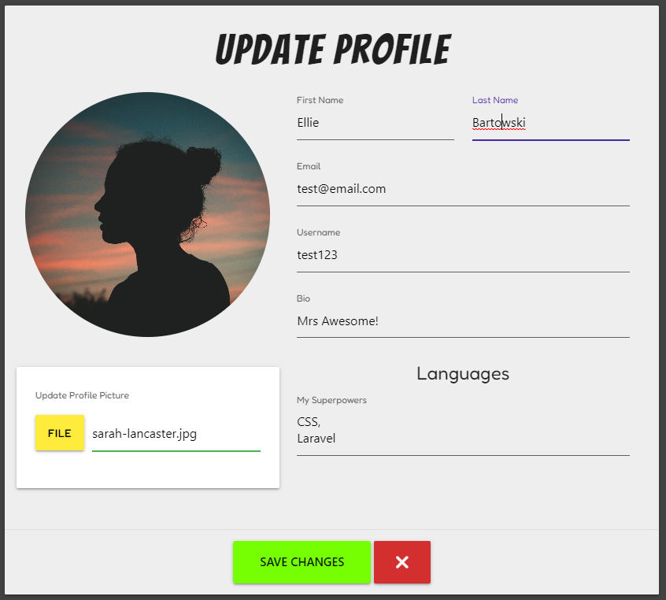
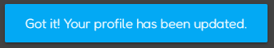
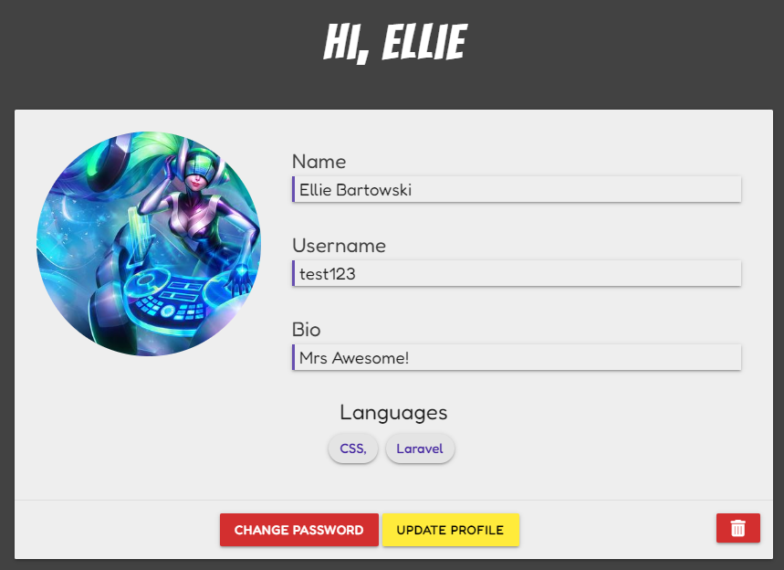

C22. As an existing user, I want to be able to delete my account.

| Feature | Action | Expected Result | Actual Result
|--- |--- |--- |---
| Profile Page  | At the bottom left corner of the profile container is a button the user can click on to trigger deletion confirmation modal for account deletion. | User successfully completes the modal and the account is deleted from the database. | As expected.

 Supporting Images 

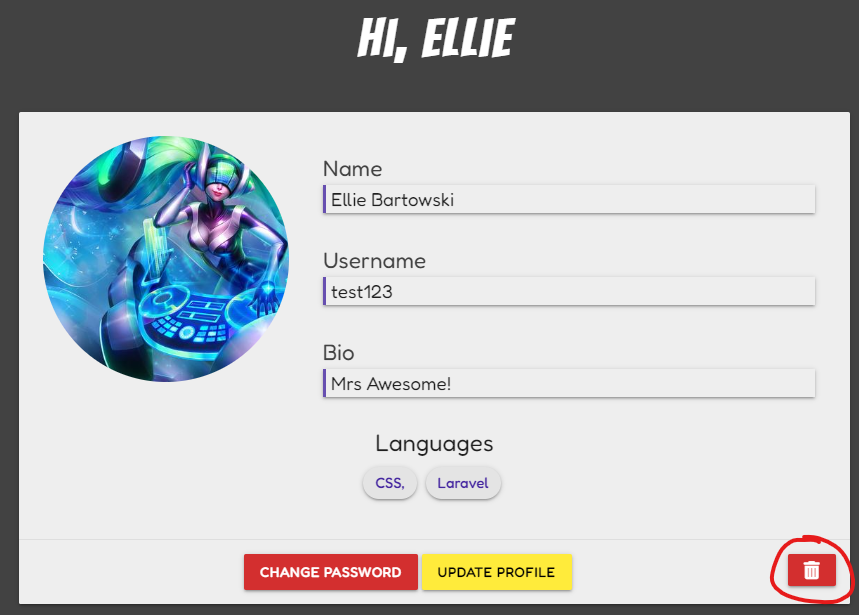
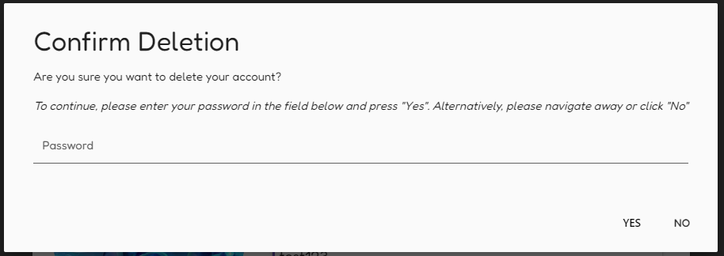
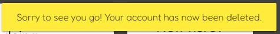

